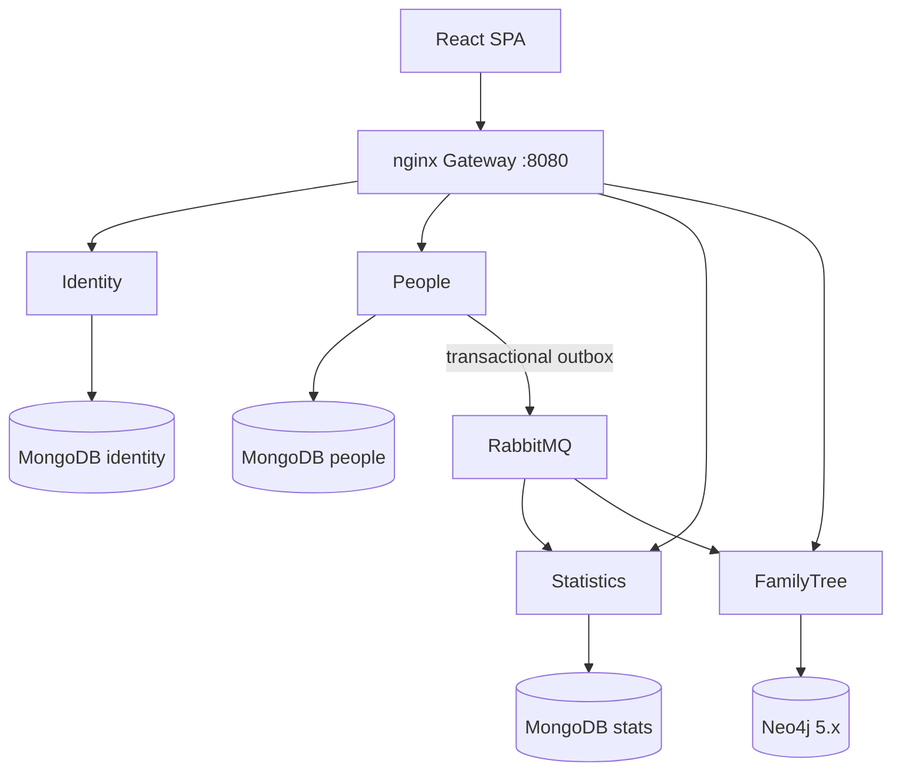

# Censo Demografico

Distributed systems and software architecture showcase implemented through a demographic census domain.

[](https://github.com/hllustosa/censo-demografico/actions/workflows/ci.yml)

This project is a hands-on exploration of distributed systems, built around a demographic census domain. It uses microservices, event-driven integration, and polyglot persistence to make architectural choices visible and concrete — so you can study how services own their data, communicate asynchronously, and stay observable in practice.

## Project overview

This reference system manages citizen census data across independent services:

- **People** — source of truth for citizen CRUD (MongoDB + transactional outbox)
- **Statistics** — aggregated demographic counters with SignalR updates (MongoDB)
- **FamilyTree** — genealogical graph queries (Neo4j 5.x over Bolt)
- **Identity** — authentication and JWT issuance (MongoDB)

Services communicate asynchronously through RabbitMQ integration events. Downstream services maintain eventually consistent read models.

## Why this project exists

Built to explore and demonstrate:

- microservice boundaries and data ownership
- synchronous edge traffic + asynchronous integration events
- polyglot persistence
- dual-write avoidance (transactional outbox)
- idempotent consumers, retries, and dead-letter queues
- OpenTelemetry-based observability
- practical DevOps (Compose, Make, CI)

## Architecture overview



Full write-up: [docs/architecture.md](docs/architecture.md) · ADRs: [docs/adr](docs/adr)

## Architectural decisions (summary)

| Decision | Why |
|----------|-----|
| Microservices | Clear ownership for a distributed-systems showcase |
| RabbitMQ events | Decouple read models; demonstrate eventual consistency |
| MongoDB | Document model for people/counters/identity |
| Neo4j | Graph queries for family relationships |
| Transactional outbox | Avoid dual-write between Mongo and the broker |
| nginx gateway | Single SPA entrypoint without adding YARP for optics |

## Trade-offs

```text
Benefits
  Clear boundaries, independent persistence, realistic async patterns

Costs
  More moving parts than a modular monolith for the same domain

Operational complexity
  Compose, replica set, broker, polyglot stores, telemetry stack

Eventual consistency
  Dashboards and trees lag the People write briefly

Distributed debugging
  Requires correlation ids, traces, and disciplined logs

Message duplication
  At-least-once delivery → idempotent consumers

Failure handling
  Retries, leases on outbox, DLQ for poison messages
```

## How to run

```bash
cp .env.example .env   # DEVELOPMENT ONLY defaults
make up
make urls
```

Application: http://localhost:8080

Observability profile:

```bash
make observability
```

## Testing

```bash
make test
make test-unit
make test-integration
```

Details: [docs/testing.md](docs/testing.md)

## Observability

OpenTelemetry traces/metrics, Prometheus, Grafana (provisioned dashboard), Jaeger.

See [docs/observability.md](docs/observability.md).

## Security notes

- Secrets live in `.env` (never commit real production secrets)
- JWT signing key is mandatory at startup (min length enforced)
- Demo credentials in `.env.example` are **DEVELOPMENT ONLY**

More: [docs/security.md](docs/security.md)

## Documentation map

| Doc | Content |
|-----|---------|
| [docs/architecture.md](docs/architecture.md) | System design |
| [docs/events.md](docs/events.md) | Integration event catalog |
| [docs/local-development.md](docs/local-development.md) | DX / Make targets |
| [docs/observability.md](docs/observability.md) | Tracing, metrics, dashboards |
| [docs/testing.md](docs/testing.md) | Test strategy |
| [docs/adr](docs/adr) | Architecture Decision Records |
| [docs/FINDINGS.md](docs/FINDINGS.md) | Initial audit findings |
