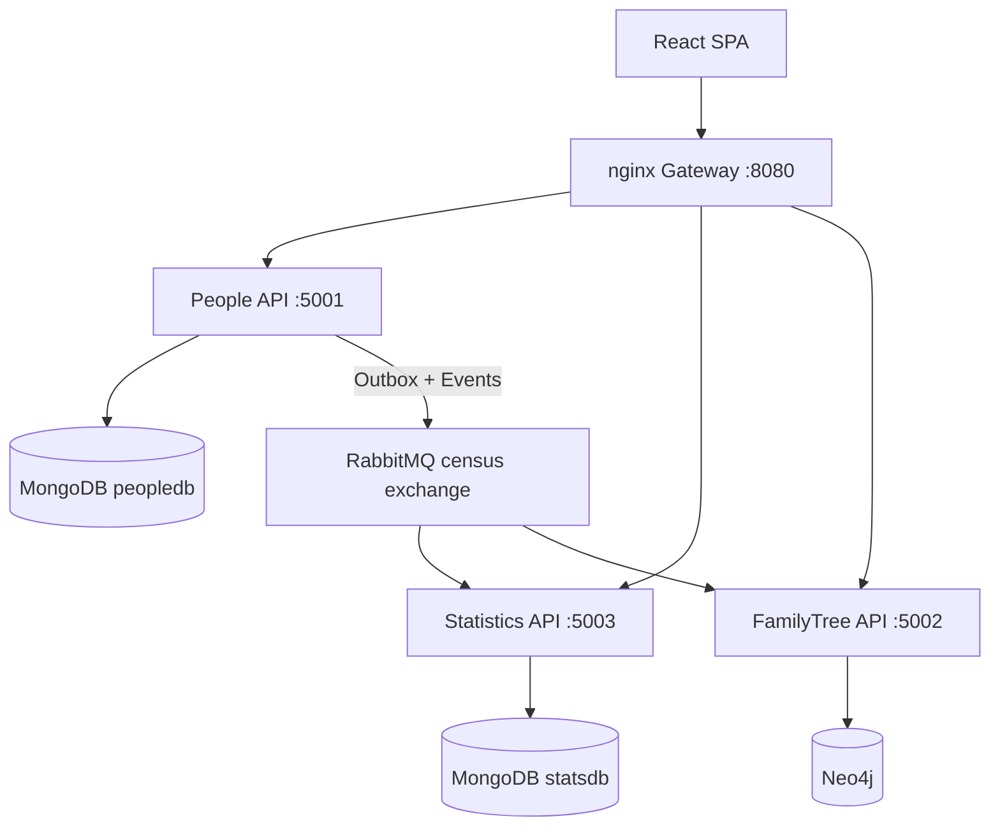

# Censo Demografico

Reference implementation of an event-driven microservices architecture for demographic census management.

[](https://github.com/hllustosa/censo-demografico/actions/workflows/ci.yml)

## Project Overview

This system manages citizen census data across three independent services:

- **People** — source of truth for citizen CRUD (MongoDB)
- **Statistics** — aggregated demographic counters with real-time dashboard updates (MongoDB + SignalR)
- **FamilyTree** — genealogical graph queries (Neo4j)

Services communicate asynchronously via RabbitMQ integration events. Each service owns its data; downstream services maintain eventually consistent read models.

## Architecture



## Services

| Service | Responsibility | Database | Port | Health |
|---------|----------------|----------|------|--------|
| **Identity** | Auth, users, JWT | MongoDB | 5004 | `/health`, `/health/ready` |
| People | CRUD, event publishing via outbox | MongoDB | 5001 | `/health`, `/health/ready` |
| Statistics | Counters, SignalR notifications | MongoDB | 5003 | `/health`, `/health/ready` |
| FamilyTree | Family tree queries | Neo4j | 5002 | `/health`, `/health/ready` |
| Frontend | Vite + React 18 + TypeScript + Ant Design (nginx gateway) | — | 8080 | `/` |
| RabbitMQ Management | Broker admin UI | — | 15672 | — |
| Neo4j Browser | Graph explorer | — | 7474 | — |

## Authentication & Roles

All APIs (exceto login/refresh) exigem JWT Bearer. Login via gateway:

```http
POST http://localhost:8080/auth/api/v1/auth/login
{ "email": "admin@censo.local", "password": "Admin@12345" }
```

| Role | Permissões |
|------|------------|
| **Registrar** | CRUD pessoas, visualizar árvore genealógica |
| **Analyst** | Dashboard e estatísticas (incl. SignalR) |
| **Admin** | Tudo + gestão de usuários |

Swagger (Development): `http://localhost:5004/swagger`, `http://localhost:5001/swagger`, etc.

## Services (detalhe)

### People Service

- **Inputs:** HTTP REST (`/api/v1/person`)
- **Outputs:** Integration events via transactional outbox
- **Events produced:** `PersonCreatedEvent`, `PersonUpdatedEvent`, `PersonDeletedEvent`

### Statistics Service

- **Inputs:** HTTP REST (`/api/personcategory`, `/api/percitycategory`), RabbitMQ events
- **Outputs:** SignalR push (`/hubs/notification`)
- **Events consumed:** All person lifecycle events

### FamilyTree Service

- **Inputs:** HTTP REST (`/api/familytree/{id}`), RabbitMQ events
- **Events consumed:** All person lifecycle events

## Reliability

| Pattern | Implementation |
|---------|----------------|
| **Transactional Outbox** | People saves events to MongoDB outbox; background processor publishes to RabbitMQ |
| **Idempotency** | Consumers track `IntegrationEvent.Id` in processed-events store |
| **Retries** | Up to 3 attempts with `x-retry-count` header |
| **Dead Letter Queue** | Exchange `census.dlx`, per-service `{queue}.dlq` |
| **Eventual Consistency** | Statistics and FamilyTree are read models updated asynchronously |

## Observability

- **Logs:** Structured JSON via Serilog (correlation ID, service name, trace ID)
- **Traces:** OpenTelemetry → Jaeger (with observability profile)
- **Metrics:** Prometheus endpoint `/metrics` on each service

Enable the observability stack:

```bash
make observability
```

| Tool | URL |
|------|-----|
| Grafana | http://localhost:3000 (admin/admin) |
| Prometheus | http://localhost:9090 |
| Jaeger | http://localhost:16686 |

## Running Locally

**Prerequisites:** Docker, Docker Compose, and Make

### Option A — Dev Container (recommended)

1. Open the project in VS Code / Cursor
2. **Reopen in Container** (uses [`.devcontainer/devcontainer.json`](.devcontainer/devcontainer.json))
3. Inside the container:

```bash
make up
make urls
```

The dev container includes .NET 8 SDK, Node 20, and Docker CLI (via host socket).

### Option B — Local machine

```bash
git clone https://github.com/hllustosa/censo-demografico.git
cd censo-demografico
make up
make urls
```

Open http://localhost:8080

### Makefile targets

Run `make help` for the full list. Common commands:

| Command | Description |
|---------|-------------|
| `make up` | Start full stack (build + detached) |
| `make down` | Stop containers |
| `make logs` | Follow container logs |
| `make test` | Run `dotnet test` |
| `make build` | Build .NET solution |
| `make observability` | Start stack with Grafana/Jaeger/Prometheus |
| `make urls` | Print service URLs |
| `make seed-people` | Seed ~100 test people (API + family links) |

### Seed test data

With the stack running (`make up`), populate MongoDB, statistics, and Neo4j via the People API:

```bash
make seed-people
```

Optional env vars: `CENSUS_COUNT`, `CENSUS_BASE_URL`, `CENSUS_EMAIL`, `CENSUS_PASSWORD`, `CENSUS_REQUEST_MS` (delay between creates; default `700` to stay under the API rate limit).

Example:

```bash
CENSUS_COUNT=50 make seed-people
```

### Service Endpoints (via gateway)

| Path | Target |
|------|--------|
| `/auth/api/v1/auth/login` | Identity login |
| `/person/api/v1/person` | People CRUD |
| `/stats/api/v1/personcategory` | Statistics by category |
| `/stats/api/v1/percitycategory` | Statistics by city |
| `/family/api/v1/familytree/{id}` | Family tree query |
| `/stats/signair/` | SignalR WebSocket |

## Testing

```bash
make test
```

Or directly:

```bash
dotnet test CensoDemografico.sln
```

Test projects:

- **Unit tests** — command handlers, validators (People, Statistics)
- **Integration tests** — MongoDB/Neo4j with Testcontainers

## CI/CD

GitHub Actions workflows in `.github/workflows/`:

| Workflow | Trigger | Purpose |
|----------|---------|---------|
| `ci.yml` | push, PR | Build, test, coverage, Docker build |
| `security.yml` | push, PR, weekly | CodeQL, dependency review, Trivy container scan |
| `release.yml` | tag `v*` | Build, push to GHCR, GitHub Release |

## Technology Stack

- .NET 8, ASP.NET Core, MediatR, FluentValidation
- MongoDB, Neo4j, RabbitMQ
- Vite, React 18, TypeScript, Ant Design, TanStack Query, React Router, Zustand
- nginx gateway
- OpenTelemetry, Serilog, Prometheus, Grafana, Jaeger
- Docker Compose, GitHub Actions, Makefile

## Contributing

See [CONTRIBUTING.md](CONTRIBUTING.md) for development setup and conventions.

## License

Licensed under the MIT License. See [LICENSE](LICENSE).
