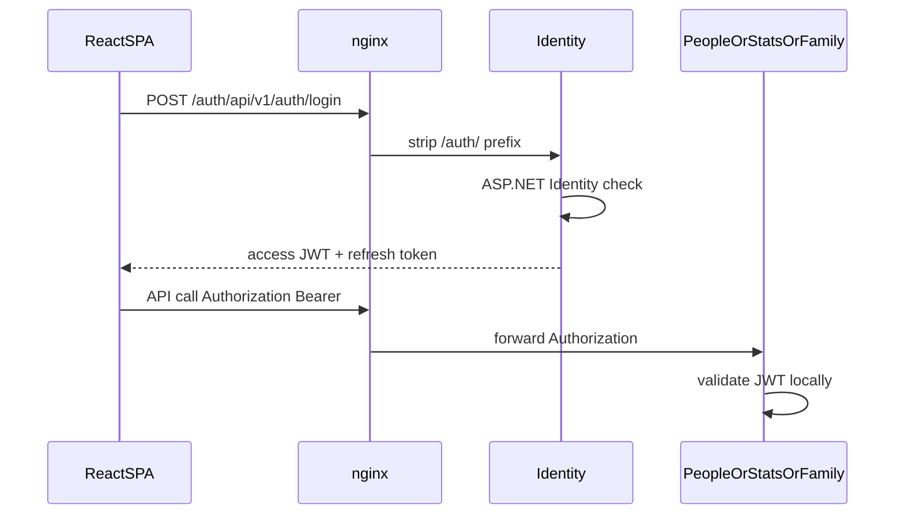
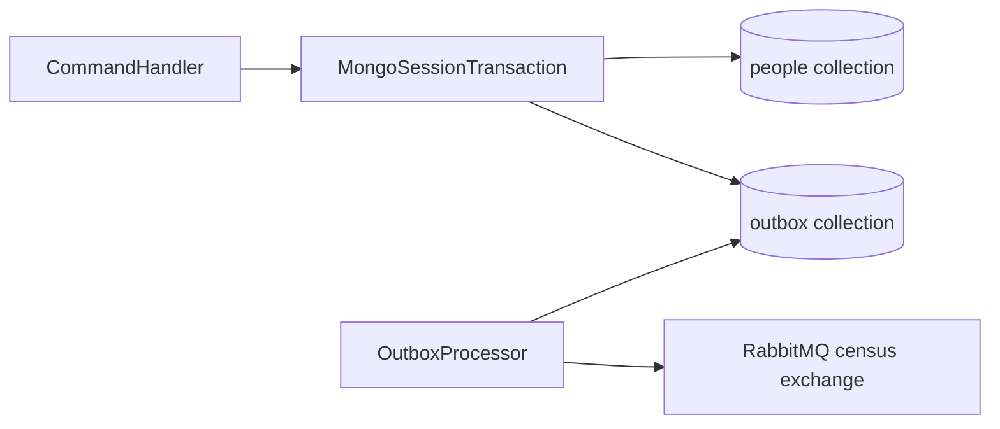

# FAQ

Interview-oriented answers for how this census showcase authenticates, persists data, publishes events, retries failures, rate-limits traffic, and routes through nginx.

For decision history see [ADRs](adr/). For the event catalog see [events.md](events.md).

## Table of contents

1. [Project intent](#1-project-intent)
2. [Authentication and authorization](#2-authentication-and-authorization)
3. [API gateway / nginx](#3-api-gateway--nginx)
4. [Rate limiting](#4-rate-limiting)
5. [MongoDB and polyglot persistence](#5-mongodb-and-polyglot-persistence)
6. [Transactional outbox](#6-transactional-outbox)
7. [RabbitMQ configuration](#7-rabbitmq-configuration)
8. [Idempotency and retries](#8-idempotency-and-retries)
9. [Neo4j and family-tree queries](#9-neo4j-and-family-tree-queries)
10. [Statistics and realtime](#10-statistics-and-realtime)
11. [Contracts and shared kernel](#11-contracts-and-shared-kernel)
12. [Observability](#12-observability)
13. [Local DX / Dev Containers](#13-local-dx--dev-containers)
14. [Trade-offs and what we did not do](#14-trade-offs-and-what-we-did-not-do)

---

## 1. Project intent

### Why does this project use microservices?

**To make distributed-systems choices visible**, not because a census demo inherently needs four deployables.

Microservices here are a learning and portfolio environment: clear ownership, separate databases, async integration, and observability. In a real product you would only split this way when organization, scale, or deployment cadence justify the cost.

See [architecture.md](architecture.md) and [adr/001-microservices-architecture.md](adr/001-microservices-architecture.md).

### What does each service own?

| Service | Owns | Database | Talks to others via |
|---------|------|----------|---------------------|
| **Identity** | Users, roles, JWT issuance | MongoDB | Sync HTTP only (`/auth/*`) |
| **People** | Citizen CRUD (source of truth) | MongoDB + outbox | Publishes Person* events |
| **Statistics** | Aggregated counters + SignalR | MongoDB | Consumes Person* events |
| **FamilyTree** | Genealogy graph reads/writes | Neo4j 5.x | Consumes Person* events |

Browser traffic is always **synchronous** (SPA → nginx → API). Cross-service domain updates are **asynchronous** (outbox → RabbitMQ → consumers). There is **no** FamilyTree→People HTTP sync.

---

## 2. Authentication and authorization

### How does login work end to end?



1. The SPA posts email/password to `/auth/api/v1/auth/login`.
2. nginx strips `/auth/` and proxies to Identity.
3. Identity validates credentials (ASP.NET Identity on MongoDB), rejects inactive users, and issues tokens via `TokenService`.
4. The SPA stores the session in `sessionStorage` and sends `Authorization: Bearer <accessToken>` on API calls.
5. nginx **forwards** the header; it does **not** validate the JWT.
6. Each microservice validates the token with shared `AddCensusAuthentication`.

On 401, the SPA tries refresh; failure clears the session.

**See also:** [security.md](security.md).  
**Code:** `Census.Identity.Api` (`AuthController`, `TokenService`), `Census.Shared/Web/AuthExtensions.cs`, SPA `features/auth` + `shared/api/client.ts`.

### Where is the JWT validated?

In **each API**, not at the gateway. Shared middleware configures JWT Bearer with:

- validate issuer, audience, lifetime, signing key
- symmetric HMAC-SHA256 key shared across services
- `RoleClaimType = ClaimTypes.Role`

SignalR also accepts the access token from `?access_token=` when the path starts with `/hubs`.

### What is the fail-fast JWT rule?

If `Jwt:SigningKey` is missing or shorter than **32 characters**, the service **refuses to start**. There is no silent weak fallback. Compose also requires `JWT_SIGNING_KEY`.

### Access token vs refresh token?

| Token | Lifetime (defaults) | Storage |
|-------|---------------------|---------|
| Access JWT | **15 minutes** | Client only |
| Refresh | **7 days** | Opaque token in MongoDB `refreshTokens` |

Refresh rotates: the old refresh token is revoked when a new pair is issued. Defaults live in `JwtOptions` / Identity `appsettings.json` (`AccessTokenMinutes`, `RefreshTokenDays`). Issuer default `census-identity`, audience `census-api`.

### What roles and policies exist?

**Roles:** `Registrar`, `Analyst`, `Admin` (seeded; demo admin from `Identity:Admin:*` / `.env`).

| Policy | Allowed roles |
|--------|----------------|
| `CanManagePeople` | Registrar, Admin |
| `CanReadPeople` | Registrar, Analyst, Admin |
| `CanViewDashboard` | Analyst, Admin |
| `CanViewFamilyTree` | Registrar, Analyst, Admin |
| `CanManageUsers` | Admin |

Controllers use `[Authorize(Policy = ...)]`. The SPA also gates routes with roles (People UI is tighter for write-focused screens).

---

## 3. API gateway / nginx

### Why nginx instead of YARP or a mesh?

This showcase needs a **single browser entry**: static SPA + path-based reverse proxy. nginx already did that job. Adding YARP would mostly be optics for a portfolio, not a clearer teaching story.

Decision: [adr/006-api-gateway.md](adr/006-api-gateway.md).  
Config: [src/frontend/Census.WebApp/nginx.conf](../src/frontend/Census.WebApp/nginx.conf).

### How does routing work?

| Browser path | Upstream (Compose DNS) |
|--------------|------------------------|
| `/` | Static Vite build (`try_files` → `index.html`) |
| `/auth/` | `identity:8080/` (prefix stripped) |
| `/person/` | `people:8080/` |
| `/family/` | `family:8080/` |
| `/stats/` | `stats:8080/` |
| `/stats/signair/` | `stats:8080/` with WebSocket upgrade |

Trailing-slash `proxy_pass` strips the location prefix so `/person/api/v1/...` becomes `/api/v1/...` on the service.

Headers forwarded: `Host`, `X-Forwarded-For`, `Authorization`.

### Does the gateway enforce auth or rate limits?

**No.** Auth and rate limiting stay in the ASP.NET services so policies remain next to the code that owns them. nginx is edge routing + SPA hosting only.

### Which ports are public?

Published to the host by default: **8080** (gateway), **15672** (RabbitMQ UI), **7474** (Neo4j Browser). Microservice HTTP, Mongo, Bolt, and AMQP stay on the internal Compose network.

---

## 4. Rate limiting

### How is rate limiting achieved?

ASP.NET Core **fixed-window** rate limiting via `AddCensusRateLimiting` in each API — **not** nginx.

| Policy | Partition | Limit |
|--------|-----------|--------|
| `global` | client IP | **100** / minute |
| `login` | client IP | **10** / minute (login + refresh) |
| `authenticated` | user id (`NameIdentifier` / `sub`), else IP | **300** / minute |

Rejected requests return **429** Problem Details (`type`: `https://censo.local/errors/rate-limit`) and may include `Retry-After`.

**Code:** `Census.Shared/Web/RateLimitingExtensions.cs`. Controllers apply `[EnableRateLimiting(...)]`; the pipeline also maps a global policy on controllers.

---

## 5. MongoDB and polyglot persistence

### Why MongoDB and Neo4j together?

| Store | Used by | Why |
|-------|---------|-----|
| MongoDB | People, Statistics, Identity | Document model fits people records, counters, ASP.NET Identity stores |
| Neo4j 5.x | FamilyTree | Parent/child graph queries |

That is **polyglot persistence**: pick the model that matches the access pattern, accept operational complexity.

See [adr/003-polyglot-persistence.md](adr/003-polyglot-persistence.md).

### Why is Mongo a replica set locally?

Multi-document **transactions** (person write + outbox insert) require a replica set in MongoDB. Compose runs a single-node set (`rs0`) initiated by `mongo-init`.

Local Compose Mongo is **unauthenticated** on purpose so RS transactions work without keyFile complexity. That is **DEVELOPMENT ONLY**. Production should use auth + keyFile (and preferably TLS).

See [local-development.md](local-development.md), [security.md](security.md).

### Does each service share one database?

**No.** Services share the Mongo *server* in Compose for convenience, but own their data/collections (and FamilyTree owns Neo4j entirely). People is the only writer of citizen source-of-truth documents.

---

## 6. Transactional outbox

### What dual-write problem does the outbox solve?

If People wrote Mongo and then published to RabbitMQ as two separate steps, you can get:

- DB committed, event never published → consumers miss updates
- event published, DB rolled back → consumers apply phantom data

The **transactional outbox** writes the domain change and the outbox row in **one Mongo transaction**, then a background worker publishes safely.

See [adr/004-transactional-outbox.md](adr/004-transactional-outbox.md).

### How does a person create/update/delete flow?



1. Handler begins a Mongo session transaction (`MongoTransactionManager`).
2. `PersonRepository` saves/updates/deletes **with the session**.
3. `OutboxIntegrationEventPublisher` inserts a serialized `OutboxMessage` into `outbox` **on the same session**.
4. Commit (or rollback on failure).
5. `OutboxProcessor` (hosted on People) claims unpublished rows and publishes to RabbitMQ.

People is configured **publisher-only** (`RabbitMqConnection:PublisherOnly`); it does not consume its own Person* events for domain sync.

**Code:** `CreatePersonHandler` / `UpdatePersonHandler` / `DeletePersonHandler`, `MongoOutboxStore`, `OutboxProcessor`.

### How does outbox claim / lease / poison work?

`OutboxProcessor` polls about every **2 seconds**, batch size **20**, lease **30 seconds**, owner id `{MachineName}-{Guid}`:

- **Claim:** atomic find-and-update of unpublished, non-failed rows whose lock is null or expired; sets `LockedUntil` / `LockedBy`.
- **Success:** publish → `MarkAsPublishedAsync`.
- **Poison (unknown `EventType`):** `MarkAsFailedAsync` (terminal) + metric.
- **Publish exception:** leave the lease; another iteration retries after expiry.

Metrics: `outbox_messages_published_total`, `outbox_messages_failed_total`.

---

## 7. RabbitMQ configuration

### What is the broker topology?

| Piece | Name | Type |
|-------|------|------|
| Main exchange | `census` | durable **fanout** |
| Dead-letter exchange | `census.dlx` | durable **fanout** |
| Consumer queues | `statistics`, `tree` (from config) | bound to `census` |
| Dead-letter queues | `{queue}.dlq` | bound to `census.dlx` |

Publish uses routing key = event type name (for example `PersonCreatedEvent`). Fanout **ignores** routing keys for delivery: every bound queue receives every message; handlers ignore irrelevant types.

**Code:** `Census.Shared/Bus/Implementation/RabbitMQEventBus.cs`.  
**See also:** [events.md](events.md), [adr/002-event-driven-communication.md](adr/002-event-driven-communication.md).

### How is the connection configured?

Per service `RabbitMqConnection` section: `HostName`, `Username`, `Password`, `QueueName`, `retryCount`, optional `PublisherOnly`. Compose injects host `rabbitmq` and credentials from `.env`.

The persistent connection uses **Polly** retries (default `retryCount` **5**, exponential backoff) when (re)connecting or publishing.

### Where do I inspect messages?

RabbitMQ Management UI (host port **15672**). DLQ messages are visible there; this demo does **not** ship an automatic redrive API.

---

## 8. Idempotency and retries

### What delivery guarantee do consumers assume?

**At-least-once.** Duplicates can happen when:

- a consumer processes then crashes before ACK
- outbox publish is retried after a broker timeout
- an outbox lease expires and another worker republishes

Consumers must be **idempotent**.

See [events.md](events.md) and [adr/002-event-driven-communication.md](adr/002-event-driven-communication.md).

### How is idempotency implemented?

Before invoking a handler, the bus checks `IProcessedEventStore.HasBeenProcessedAsync(event.Id)`. After success it calls `MarkAsProcessedAsync`.

| Consumer | Store |
|----------|--------|
| Statistics | MongoDB `processed_events` (unique index on event id) |
| FamilyTree | Neo4j `(:ProcessedEvent { eventId, ... })` |

Event `Id` is the idempotency key.

### How do consume retries and DLQ work?

```text
Handler success → ACK
Handler failure → republish to census with x-retry-count++, ACK original
x-retry-count >= 3 → publish to census.dlx → land in {queue}.dlq → ACK
```

There is **no** delayed/TTL retry queue. Retries are immediate republish — acceptable for a demo, not ideal under poison spikes.

### How is outbox retry different from consume retry?

| Layer | Mechanism |
|-------|-----------|
| Outbox → broker | Lease expiry; leave unpublished on publish failure |
| Broker → consumer | `x-retry-count` header, max **3**, then DLQ |

Both exist so “publish failed” and “handler failed” are handled separately.

---

## 9. Neo4j and family-tree queries

### Why Neo4j for FamilyTree?

Parent/child navigation is a graph problem. Neo4j **5.26** over **Bolt** (`Neo4jClient` / `BoltGraphClient`) keeps relationship queries natural and uses a maintained driver stack.

See [adr/003-polyglot-persistence.md](adr/003-polyglot-persistence.md).

### How does the graph stay in sync with People?

**Events only.** FamilyTree subscribes to `PersonCreated` / `PersonUpdated` / `PersonDeleted` and updates Neo4j. It does **not** call People over HTTP on read (that anti-pattern was removed).

People remains source of truth; the graph is an **eventually consistent** projection.

See [adr/002-event-driven-communication.md](adr/002-event-driven-communication.md).

### How are family-tree reads implemented?

HTTP `GET /api/v1/familytree/{id}?level=` → MediatR → `PersonFamilyTreeRepository.GetFamilyTree`.

Model: `:Person` nodes with `Id`, `Name`, `FatherId`, `MotherId`; relationships `[:PARENT]` / `[:CHILD]`.

Reads are **not** a single recursive Cypher. The repository loads the root, then BFS ancestors (via parent ids) and descendants (property match), and builds DTOs in memory. Writes use `MERGE`/`CREATE`/`DETACH DELETE` from event handlers.

**Code:** `PersonFamilyTreeRepository`, `Neo4jConnection`, FamilyTree controllers/handlers.

### What if Neo4j was empty after a rebuild?

Use the offline backfill helper (`scripts/backfill-familytree.mjs`) to list/verify against People. That is **not** the hot path; normal operation is event-driven.

---

## 10. Statistics and realtime

### How do statistics stay updated?

Statistics consumes the same Person* fanout events, updates category / per-city counters in its own MongoDB, and records processed event ids for idempotency.

### How do live dashboard updates work?

Statistics exposes SignalR hubs. The SPA connects through the gateway WebSocket location (`/stats/signair/`). JWT is accepted from the query string on `/hubs` paths (see auth section).

Policy for dashboard viewing: `CanViewDashboard` (Analyst, Admin).

---

## 11. Contracts and shared kernel

### Where do integration events live?

Canonical payloads live in **`Census.Contracts`** (for example `PersonCreatedEvent`, `PersonDTO`). Services should treat these as versioned integration contracts, not internal domain entities.

Compatibility shims may still exist in Shared for handler constraints; new event shapes belong in Contracts.

### What is still in `Census.Shared`?

Cross-cutting **technical** pieces: RabbitMQ bus, outbox processor, auth/rate-limit/web defaults, observability helpers. That is a pragmatic shared kernel, not a place for People domain logic. Further package splits were deferred to keep the showcase focused.

### What about `Census.Testing`?

Test-only helpers (for example `TestJwtHelper`). Not shipped in production images.

---

## 12. Observability

### How do I turn on tracing and metrics?

```bash
make observability
```

That starts the stack with `OTEL_EXPORTER_OTLP_ENDPOINT` pointed at the collector, plus Grafana, Prometheus, and Jaeger (profile services).

See [observability.md](observability.md), [adr/005-observability.md](adr/005-observability.md).

### What should I look at for messaging health?

- Outbox metrics (`outbox_messages_*`) for publish lag / poison
- Consumer failure → retry → DLQ path in RabbitMQ UI
- Distributed traces across People → bus → Statistics / FamilyTree when OTEL is enabled

Health endpoints live on each service (`/health`, `/health/ready`); nginx does not aggregate them on the public host by default.

---

## 13. Local DX / Dev Containers

### How do I run the stack?

```bash
cp .env.example .env   # or make env
make up
make urls
```

Application URL: `http://localhost:8080` on a normal Docker Desktop / host shell.

Details: [local-development.md](local-development.md).

### Why does `make seed-people` fail with `fetch failed` in a Dev Container?

Compose publishes port **8080** on the **Docker host**, not on the Dev Container’s loopback. From the workspace shell, `localhost:8080` often cannot connect.

The seed script probes `127.0.0.1` / `localhost`, then falls back to `http://host.docker.internal:8080`. You can also force:

```bash
CENSUS_BASE_URL=http://host.docker.internal:8080 make seed-people
```

### How do integration tests reach Mongo/Neo4j in nested Docker?

Testcontainers mapped `localhost` ports are often unreachable from the Dev Container. Fixtures prefer the container **bridge IP** and **log-based readiness** (Docker API), with `TESTCONTAINERS_RYUK_DISABLED=true` when Ryuk is problematic.

See [testing.md](testing.md).

### How do I seed sample people?

```bash
make seed-people
```

Uses Identity login + People create APIs through the gateway, with pacing to stay under rate limits (`CENSUS_REQUEST_MS`, default 700ms).

---

## 14. Trade-offs and what we did not do

### What trade-offs should interviewers expect you to own?

| Choice | Trade-off |
|--------|-----------|
| Custom RabbitMQ bus | Less features than MassTransit/NServiceBus; clearer teaching surface |
| Fanout + immediate republish retries | Simple; no delayed backoff queue |
| DLQ observe-only | Safe demo; no built-in redrive API |
| Local Mongo without auth | Easy RS transactions; **not** production-ready security |
| nginx gateway | Thin edge; no central JWT enforcement |
| Stay on .NET 8 LTS | Deliberate; not chasing newest runtime |

### What did we intentionally avoid?

- Service-to-service HTTP for FamilyTree sync  
- Silent JWT fallbacks  
- Publishing every microservice port to the host  
- Treating Shared as a dumping ground for domain events (Contracts extracted instead)  
- Over-building saga/orchestration frameworks for three Person* events  

### Where do I read more?

| Doc | Content |
|-----|---------|
| [architecture.md](architecture.md) | System design |
| [events.md](events.md) | Event catalog and delivery rules |
| [security.md](security.md) | Secrets and JWT startup rules |
| [observability.md](observability.md) | OTEL / Grafana / Jaeger |
| [testing.md](testing.md) | Unit / integration / architecture tests |
| [local-development.md](local-development.md) | Make targets and Dev Container notes |
| [adr/](adr/) | Architecture Decision Records |

